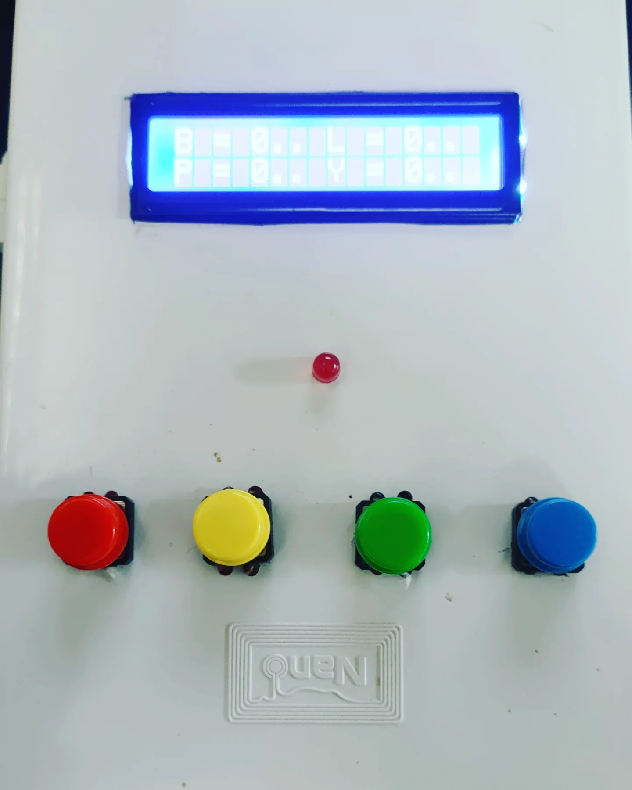

  

 

# 🕯️What can Lemon counting do?

 - It can count all four numbers of lemons with four IR infrared sensors and will display the number of lemons of each number on the LCD screen. And when the number of lemons reaches the specified number, there will be a notification light and the servo will close that channel. We can reset. You can set a new value to continue counting. Each button can reset the value of that number without resetting every number.
